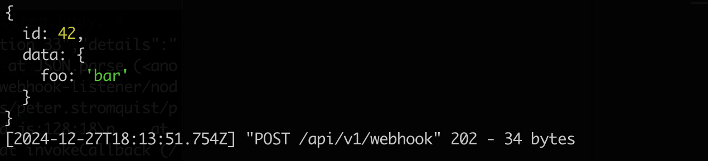

# webhook-listener

A simple Node.js HTTP server that as a dummy webhook client. Useful for testing webhooks, when used in conjunction with a tool like [ngrok](https://ngrok.com).

## Behavior

This simple HTTP server will wait for HTTP `POST` requests to the following endpoint:

```text
/api/v1/webhook
```

If the request is properly authorized with a [bearer token](https://datatracker.ietf.org/doc/html/rfc6750#section-2.1) that contains a configured API key, then the JSON payload is simply logged to the console in color:



When a successful request like this occurs, the server will always respond with an HTTP 202 (Accepted).

This behavior allows you to test that a webhook integration is working and sending the expected payload.

## Setup

1. Install the version of Node specified in the [package.json](./package.json) file

   - i.e. use [nvm](https://github.com/nvm-sh/nvm)

1. Install dependencies

   ```sh
   npm install
   ```

1. Configure by creating a local `.env` file with the following settings:

   - `PORT`: The HTTP port to listen on (eg. `8080`)
   - `CLIENT_API_KEY`: An API key that the webhook client must provide as a bearer token

## Use

1. Run the server

   ```sh
   npm start
   ```

1. Start a local proxy tool (such as `ngrok`) that will forward requests to an externally-accessible host to the local instance of `webhook-listener`:

   ```sh
   ngrok http http://localhost:8080
   ```

1. Test the listener by sending a request:

   ```sh
   curl -X POST https://$NGROK_DOMAIN/api/v1/webhook \
     -H "Content-Type: application/json" \
     -H "Authorization: Bearer $CLIENT_API_KEY" \
     -d '{"id": 42, "data": {"foo": "bar"}}'
   ```
